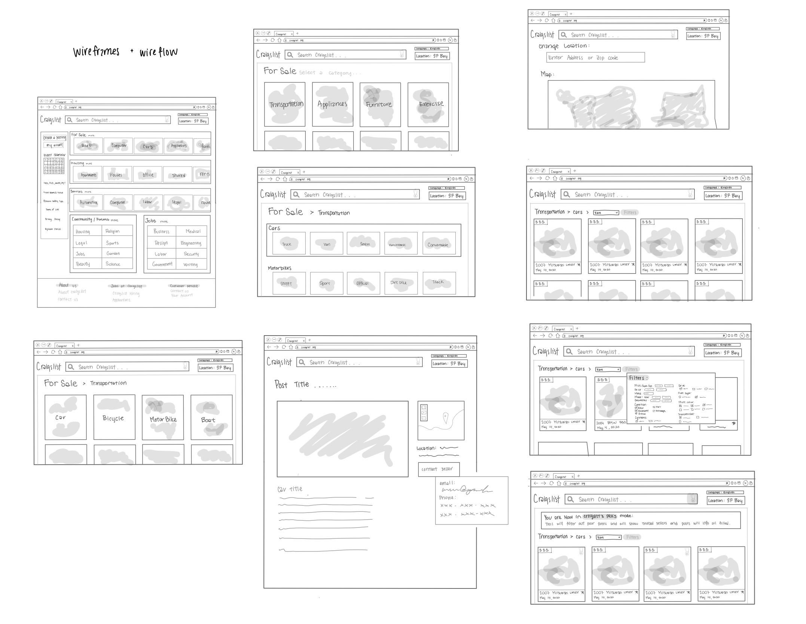
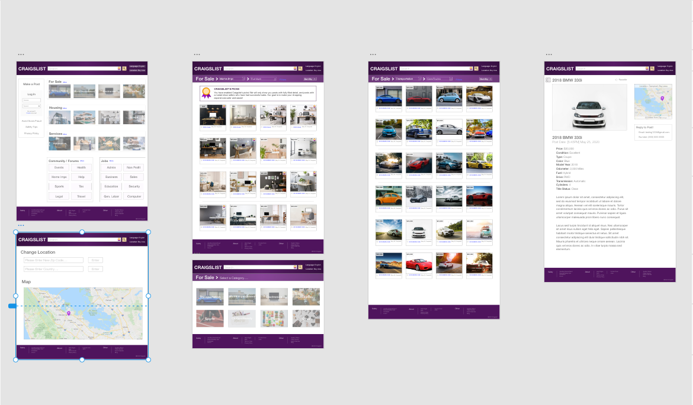
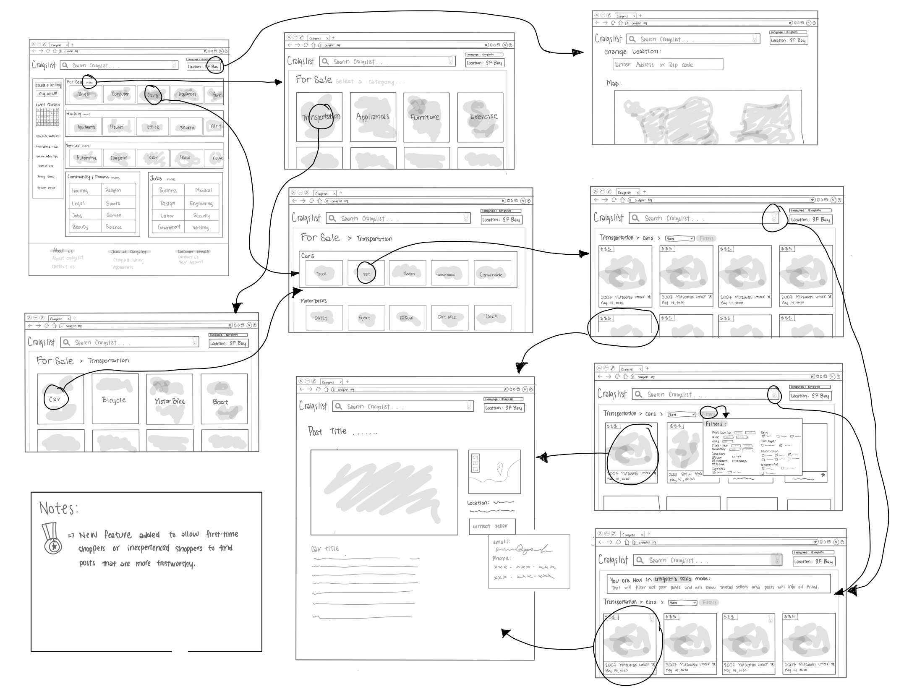
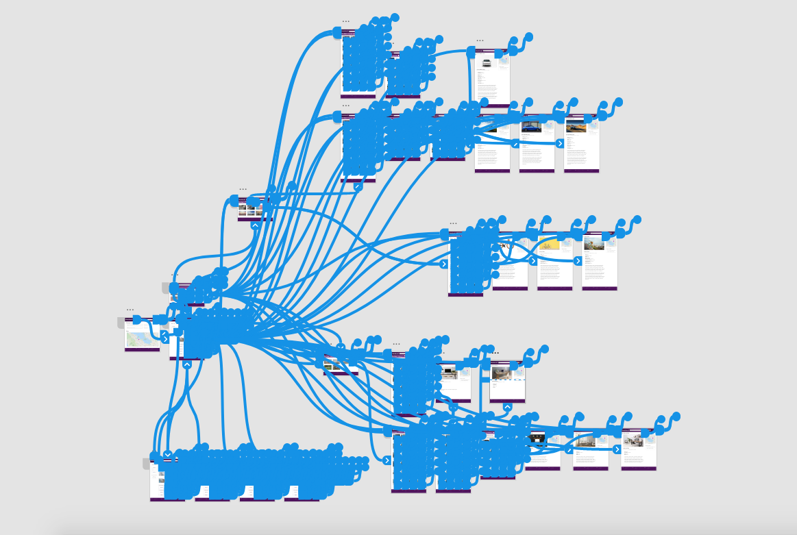

# DH150_Assignment8

## Udpated Craigslist
## Chereen Tam

### Introduction:
Craigslist is a web-based service that allows anyone to post things such as jobs, services, gigs, housing, for sale items, and etc. The users then are able to contact each other in order to fulfill the intended service. This service is able to connect users that are local to each other as well as users that are far away.

### Design Statement:

### Competitor Analysis: Heuristic Evaluation/Usability Testing
The purpose of UT is to uncover any issues with the developmental and design process of the website. UT uses a small sample size that requires the participants to do a detailed test in order for the testers to collect empirical data. These tests are very controlled and can be done in a location or remotely. The participants will come from different backgrounds and they are usually asked to perform realistic tasks while using the product. As a result, UT is able to uncover more global usability problems. The goal of usability testing is to inform the design, eliminate frustration, and improve profitability.
[Read More...](https://github.com/chereeny/DH150_Assignment1)
[Read More...](https://github.com/chereeny/DH150-Assignment2)

### User Research: 
The main activity of this project will support users in trying to buy and sell items in an online marketplace website allowing users within the same area, or worldwide if they choose so, to communicate, discuss, buy, sell items. This will hopefully allow people to buy and sell unwanted items at a cheaper price than retail. However, this activity and interview will mainly focus on the searching and buying aspect of the overall activity.

The basic need involved in this activity is physiological and the need for financial safety. This activity will allow people to acquire any items they need for their well being, for example, shelter, clothing, and transportation, fulfilling the physiological aspect of basic need. This activity will also fulfill the basic need for safety, specifically financial security, by allowing people to sell their unwanted items for money.

The traditional means in satisfying these needs are large retail stores, general stores, online retail stores. However, for those who are looking to buy items at a cheaper price, they will go to online marketplaces.

The limitations of buying and selling in person, which is the traditional method, is the need for transportation. Technology can help overcome limitations by providing online services, which many have now, and providing better means of communication. Additionally, a better filtering system of fake sites and sellers could be better eliminated with the use of modern day technology.
[Read More...](https://github.com/chereeny/-DH150-Assignment4)

### UX Storytelling:
The purpose of UX storytelling is to communicate a certain product, design, and story to the audience. To do UX storytelling, the creators must think and work from the users perspective in order to understand their behaviors and motivations. By understanding and testing different users, the creators will be able to create a better product that is better for everyone. Ultimately, UX storytelling must be able to fulfill the users needs and goals and deliver the product’s main focus.
[Read More...](https://github.com/chereeny/DH150-Assignment5)

### Wireframe and graphic design element variation:

For this project, I will be working with the website craigslist. Craigslist is a website that serves as an online marketplace for people to sell or buy items, find jobs, talk on forums, and find housing. Craigslist is mainly known for buying and selling items, so for this project, I will be focusing on improving the buying aspect of this site.
After placing this website through a heuristic evaluation, usability testing, UX storytelling process, and interface design evaluation, I believe that the site can be improved upon to make buying items in online marketplaces more intuitive and more safe. The site is difficult to use due to the design interface. The website is overwhelming due to the excess amount of words and the bright blue text color. Additionally, the main page has no images to help register the categories immediately, instead the user must scan through all the sections listed in small fine print on the front page.
Therefore, I have created a low-fidelity prototype to demonstrate how these features will be integrated onto the site. I have created wireframes and wireflows to demonstrate the functionality and the flow of the new site. This will show me the thought process of the users when working through the prototype and allow me to make adjustments accordingly.
[Read More...](https://github.com/chereeny/DH150-Assignment6)

### Low-Fidelity Prototype (Wireflow):

[Read More...](https://github.com/chereeny/DH150-Assignment6)

### High-Fidelity Prototype:

[Prototype Link](https://xd.adobe.com/view/65c01a42-19a9-414c-55ef-66b362ae7e15-13f1/)

This project is based off of the site ‘Craigslist’. Craigslist is a website that functions as an online marketplace and community that allows users to buy and/or sell items, discuss on forums, find housing, and explore jobs. However, Craigslist is mainly known and used for their online marketplace, specifically, buying and selling items. This project will focus on the searching aspect when buying items on the website. The prototyped site will demonstrate improvements in the overall interface design, the ability to quickly find information, and safety features when looking at posts.
[Read More...](https://github.com/chereeny/DH150-Assignment7)

### Evaluation and Revision History:
[Read More...]()
### Pitch Video:

### Conclusion:
